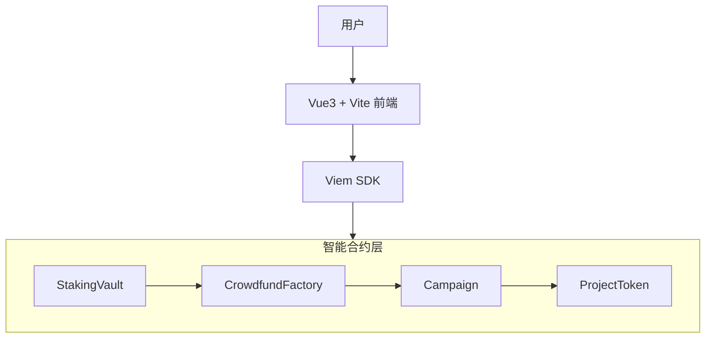

# CrowdfundSystem — 去中心化众筹平台

基于 **Hardhat + Vue3 + Viem** 的全栈去中心化众筹平台，支持 **ETH 质押挖取 R 奖励**、**R 抵扣认购**、**Campaign 创建/终结/领取/退款/提款** 完整流程。

## 系统架构



## 技术栈

| 层级 | 技术 |
|------|------|
| **区块链框架** | Hardhat + ethers.js |
| **Solidity 版本** | ^0.8.20 |
| **前端框架** | Vue 3 (Composition API + `<script setup>`) |
| **构建工具** | Vite |
| **链交互 SDK** | Viem (PublicClient + WalletClient) |
| **钱包** | MetaMask (CustomProvider) |
| **节点** | Hardhat Network (Chain ID: 31337) |

## 合约模块设计

### 1. StakingVault — 质押金库

用户质押 ETH 到金库，**随时间自动累积 R 奖励**；R 可在众筹认购时抵扣实际付款金额。

| 函数 | 说明 |
|------|------|
| `stake()` | 质押 ETH，更新用户份额与奖励快照 |
| `unstake(amount)` | 赎回指定数量 ETH |
| `userR(user)` | 查询用户累积的 R 奖励（含待结算部分） |
| `totalR()` | 查看全平台已发行的 R 总量 |
| `spendR(user, amount)` | 仅已注册 Campaign 可调用，消耗用户 R |
| `registerCampaign(campaign)` | 仅工厂可调用，注册 Campaign 到白名单 |
| `setFactory(factory)` | 更新工厂地址（部署时权限初始化） |

**奖励公式：**
```
R_per_second = totalETH * REWARD_PER_ETH_PER_DAY / SECONDS_PER_DAY
accRPerETH += R_per_second * elapsed / totalETH
userR = user.rewardPending + (user.amount * accRPerETH - user.rewardDebt)
```

### 2. CrowdfundFactory — 众筹工厂

创建并管理所有 Campaign 实例，收取保证金并注册到金库白名单。

| 函数 | 说明 |
|------|------|
| `createCampaign(target, totalToken, ratio, name, symbol)` | 创建新 Campaign，需附带保证金 |
| `campaignCount()` | 查询已创建 Campaign 总数 |
| `allCampaigns(index)` | 按索引获取 Campaign 地址 |

### 3. Campaign — 众筹项目

每个 Campaign 独立运行，处理用户认购、奖励抵扣、终结结算。

| 函数 | 说明 |
|------|------|
| `pledge()` | 用户认购，支持 R 抵扣折扣 |
| `finalize()` | 创建者手动终结（检查是否达标） |
| `claim()` | 成功项目：参与者按比例领取 ProjectToken |
| `refund()` | 失败项目：参与者退回支付的 ETH |
| `withdrawRaised()` | 成功时创建者提取募集款 |
| `withdrawDeposit()` | 创建者取回保证金（终结后可提） |

**折扣计算流程：**
```
d = MathLogic.calculateDiscount(totalR, totalETH, dMin, dMax, Aref, k)
maxREquivalent = userR * d / 1e18
actualREquivalent = min(maxREquivalent, msg.value * maxDeductionRatio / 10000)
nominalContribution = msg.value + actualREquivalent
```

### 4. ProjectToken — 项目代币

基于 OpenZeppelin ERC20，由 Campaign 部署时自动创建，代币总量在构造函数中铸造给 Campaign 合约。

### 5. MathLogic — 折扣计算库

动态折扣算法，根据全平台 R 总量与 ETH 总量计算当前折扣率。

## 快速开始

### 前置条件

- Node.js >= 18
- MetaMask 浏览器插件
- Hardhat 本地节点

### 步骤

```bash
# 1. 克隆项目
git clone https://github.com/xuziran687/CrowdfundSystem.git
cd CrowdfundSystem

# 2. 安装合约依赖 & 编译
cd contract
npm install
npx hardhat compile

# 3. 启动 Hardhat 本地节点（保持终端运行，--hostname 0.0.0.0 允许局域网访问）
npx hardhat node --hostname 0.0.0.0

# 4. 新终端窗口 — 部署合约（自动生成地址并同步到前端）
npx hardhat run scripts/deploy.js --network localhost

# 5. 安装并启动前端
cd ../frontend
npm install
npm run dev
```


### MetaMask 配置

1. 打开 MetaMask → **导入钱包** → 输入以下助记词（Hardhat 默认助记词，每次启动节点账号一致）：
   ```
   test test test test test test test test test test test junk
   ```
2. 切换到 Hardhat Local 网络（连接时前端会自动添加该网络，RPC URL 会动态匹配你机器的实际 IP，局域网设备也能自动适配）
3. 如需手动添加，参数如下：
   - **网络名称**: Hardhat Local
   - **RPC URL**: `http://你机器的局域网IP:8545`（例如 `http://192.168.1.100:8545`）
   - **链 ID**: `31337`
   - **货币符号**: `ETH`

### 运行测试


### 运行测试

```bash
cd contract
npx hardhat test
```

## 前端功能

### StakingPanel — 质押面板

| 区块 | 功能 |
|------|------|
| 质押 ETH | 输入金额 → 确认质押，自动开始累积 R |
| 赎回 ETH | 输入金额 → 确认赎回，取回质押的 ETH |
| 统计卡片 | 实时显示已质押量、可抵扣 R、账户余额、金库总锁仓量 |
| 抵扣率条 | 直观展示 R 与 ETH 的比率 |

### CrowdfundingPanel — 众筹面板

| 区块 | 功能 |
|------|------|
| 工厂信息 | 显示工厂地址、金库地址、最小保证金 |
| 创建 Campaign | 输入目标/总量/抵扣比例/名称/符号/保证金 → 创建 |
| Campaign 列表 | 侧边栏展示所有已创建 Campaign，点击查看详情 |
| 项目详情 | 募集进度条、状态标签、基本信息网格 |
| 认购输入 | 输入 ETH 数量认购，自动利用 R 抵扣 |
| 创建者操作 | 终结众筹、提取募集款、提取保证金 |
| 参与者操作 | 领取项目代币（成功）、申请退款（失败） |

## 文件结构

```
CrowdfundSystem/
├── contract/                      # Hardhat 合约项目
│   ├── contracts/
│   │   ├── Campaign.sol           # 众筹项目合约
│   │   ├── CrowdfundFactory.sol   # 众筹工厂合约
│   │   ├── MathLogic.sol          # 折扣计算库
│   │   ├── ProjectToken.sol       # ERC20 项目代币
│   │   ├── StakingVault.sol       # 质押金库合约
│   │   └── interfaces/
│   │       └── IStakingVault.sol  # 金库接口
│   ├── scripts/
│   │   └── deploy.js              # 部署脚本（地址同步至前端）
│   ├── test/
│   │   └── staking-campaign.test.js
│   └── hardhat.config.js
│
├── frontend/                      # Vue3 前端项目
│   ├── src/
│   │   ├── App.vue                # 主布局
│   │   ├── main.js                # 入口
│   │   ├── components/
│   │   │   ├── StakingPanel.vue   # 质押面板
│   │   │   └── CrowdfundingPanel.vue  # 众筹面板
│   │   ├── composables/
│   │   │   └── useWallet.js       # 钱包连接逻辑
│   │   └── sdk/
│   │       ├── contract.js        # 合约地址与 ABI
│   │       ├── index.js           # Viem SDK 封装
│   │       └── erc20.js           # ERC20 ABI
│   ├── index.html
│   └── vite.config.js
│
├── process-diagram.md             # 业务流程图
├── project-analysis.md            # 项目分析文档
└── README.md                      # 本文件
```

## 已知问题

1. **addresses.json 需本地生成**：`frontend/src/sdk/addresses.json` 不在仓库中，首次需运行 `npx hardhat run scripts/deploy.js --network localhost` 生成。
2. **R 代币显示**：R 是独立奖励单位（18 位精度），与 ETH 单位在概念上分离，前端已做独立 `formatRValue` 格式化。
3. **Campaign 列表轮询**：目前使用 5 秒定时轮询刷新，未使用事件监听模式。

## 生态系统流程

```
质押 ETH → 累积 R 奖励 → 浏览 Campaign → 认购（R 抵扣折扣）
                                                │
                                     ┌──────────┴──────────┐
                                     ▼                     ▼
                                 成功 (Claim Token)      失败 (Refund ETH)
```

## License

MIT
