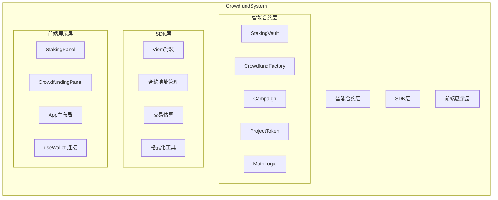
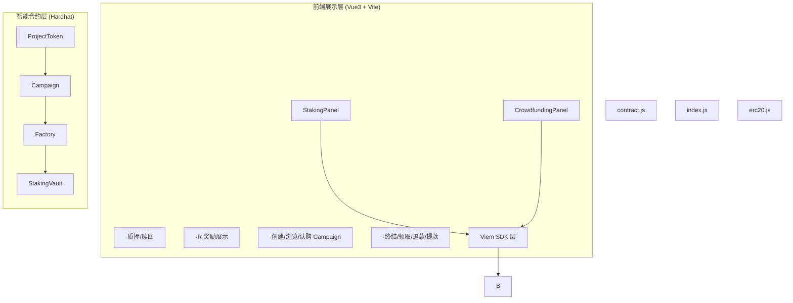
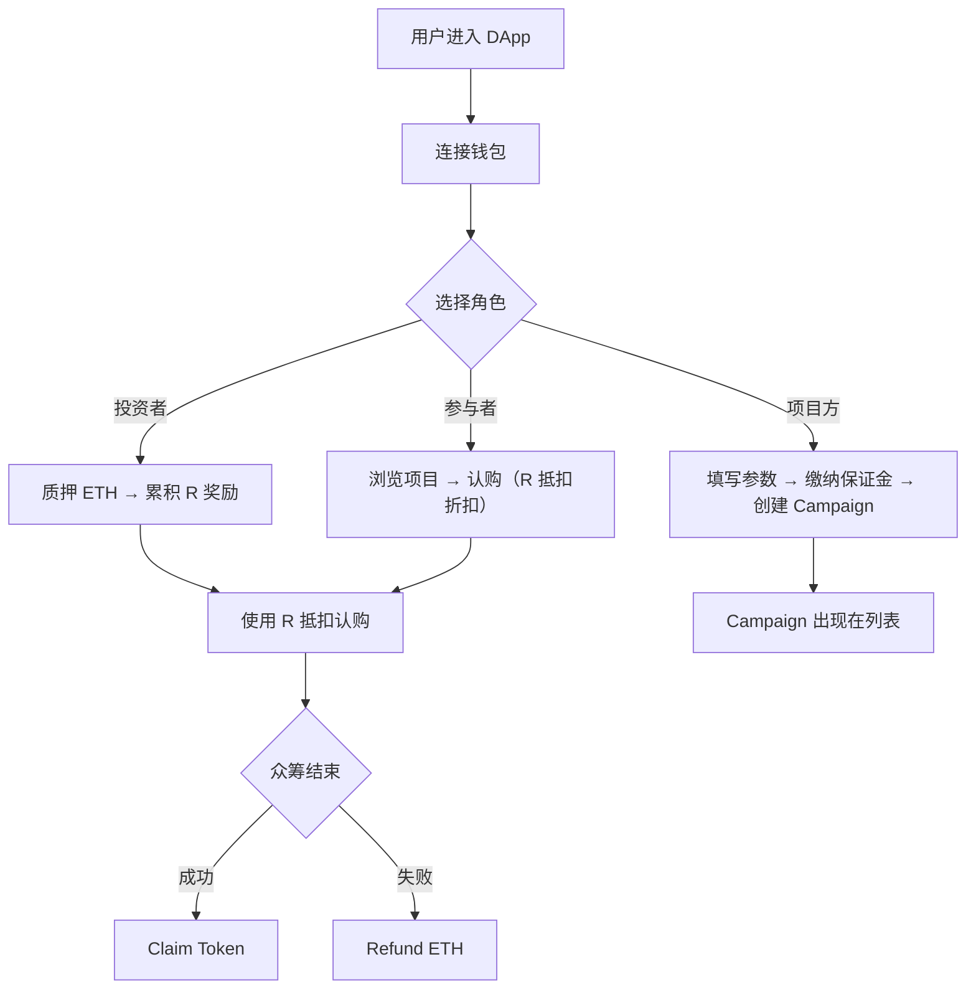

课程设计说明书

（智能合约与Solidity编程）

|      |     |                      |
| ---- | --- | -------------------- |
| 题目   | ：   | 基于以太坊的去中心化众筹平台的设计与实现 |
|      |     |                      |
|      |     |                      |
| 学院   | ：   | 计算机科学与工程学院           |
| 专业班级 | ：   | 区块链24-               |
| 学号   | ：   |                      |
| 学生姓名 | ：   |                      |
| 指导老师 | ：   | 王丽                   |
|      |     |                      |
|      |     |                      |
|      |     |                      |

摘要

本文设计并实现了一个基于以太坊的去中心化众筹平台 CrowdfundSystem。平台采用 Hardhat 作为智能合约开发框架，Solidity ^0.8.20 编写合约逻辑，前端使用 Vue 3 + Vite + Viem 构建用户界面。系统核心功能包括：用户可通过质押 ETH 到金库合约（StakingVault）随时间自动累积 R 奖励；项目方可创建众筹 Campaign 并设定目标金额与代币总量；参与者在认购时可使用累积的 R 奖励按动态折扣率抵扣实际付款金额。系统整体采用三层架构：智能合约层负责链上状态管理与业务逻辑，SDK 层封装 Viem 合约交互，前端层提供可视化操作界面。合约层包含 StakingVault、CrowdfundFactory、Campaign、ProjectToken 和 MathLogic 五个模块，各模块职责清晰、权限控制明确。测试覆盖了质押奖励计算、众筹全流程（创建、认购、终结、领取、退款、提款）以及失败退款场景，验证了系统的正确性与可靠性。本文详细阐述了系统的需求分析、架构设计、实现细节与测试过程，总结了开发中遇到的关键问题及解决方案。

关键词：Solidity；智能合约；去中心化众筹；Hardhat；Vue 3

（行间距固定20磅）

目录

[1 需求分析 1](#__RefHeading___Toc25195)

[1.1 系统需求 1](#__RefHeading___Toc22682)

[1.2 系统功能分析 2](#__RefHeading___Toc22683)

[1.3 系统功能模块设计 2](#__RefHeading___Toc22684)

[1.4 安全性与完整性要求 3](#__RefHeading___Toc22685)

[2 系统设计 4](#__RefHeading___Toc4007)

[2.1 系统架构 4](#__RefHeading___Toc4008)

[2.2 智能合约设计 4](#__RefHeading___Toc4009)

[2.3 前端设计 6](#__RefHeading___Toc4010)

[2.4 业务流程设计 7](#__RefHeading___Toc4011)

[3 系统实现 8](#__RefHeading___Toc2185)

[3.1 智能合约实现 8](#__RefHeading___Toc2186)

[3.2 前端实现 9](#__RefHeading___Toc2187)

[3.3 部署与合约交互实现 10](#__RefHeading___Toc2188)

[4 系统测试 11](#__RefHeading___Toc6851)

[4.1 测试环境 11](#__RefHeading___Toc6852)

[4.2 测试用例 11](#__RefHeading___Toc6853)

[4.3 测试结果 11](#__RefHeading___Toc6854)

[5 总结 12](#__RefHeading___Toc13653)

[参考文献 13](#__RefHeading___Toc6669)

1 需求分析

1.1 系统需求

传统的众筹平台通常依赖中心化机构进行资金托管、项目审核与结算分配，存在信任成本高、资金流向不透明、平台抽成高等问题。区块链技术的去中心化、不可篡改和智能合约自动执行等特性，为构建透明可信的众筹平台提供了新的技术路径。

在去中心化众筹场景中，用户不仅作为投资者参与项目，还可以通过质押行为为平台贡献流动性并获得奖励。这种"质押即挖矿"的激励机制能够有效提升用户参与度和资金利用率。基于以上考虑，本系统旨在设计一个基于以太坊智能合约的去中心化众筹平台，实现以下目标：

（1）用户可将 ETH 质押到平台金库，随时间自动累积 R 奖励代币，奖励数额与质押金额和质押时长成正比。

（2）项目方可通过工厂合约创建众筹项目（Campaign），设定募集目标、代币总量与折扣参数，并缴纳保证金以约束其行为。

（3）参与者可使用累积的 R 奖励在认购时享受动态折扣，折扣率根据全平台 R 总量与 ETH 总量的比例自动计算调整。

（4）众筹结束后，若达标则项目方提取募集款并退还保证金，参与者按贡献比例领取项目代币；若失败则参与者全额退款。

（5）提供直观的 Web 前端界面，支持钱包连接、质押管理、众筹浏览与操作。

1.2 系统功能分析

本系统主要功能分为以下模块：

（1）质押管理功能：用户可存入 ETH 参与质押，查看质押余额与已累积的 R 奖励；可随时赎回部分或全部质押的 ETH。

（2）R 奖励累积功能：系统根据用户质押金额与质押时长自动计算 R 奖励，奖励计算在每次质押、赎回或查询时更新。

（3）众筹创建功能：项目方可通过工厂合约创建 Campaign，需指定募集目标、项目代币总量、最大折扣比例、代币名称与符号，并支付最低保证金。

（4）折扣认购功能：用户在认购 Campaign 时可输入名义投资金额，系统根据当前折扣率计算可用的 R 抵扣额度，用户只需支付扣除折扣后的实际 ETH。

（5）众筹结算功能：包括终结（Finalize）、领取代币（Claim）、退款（Refund）、提取募集款（WithdrawRaised）和提取保证金（WithdrawDeposit）。

（6）钱包连接功能：通过 MetaMask 连接以太坊钱包，自动切换至 Hardhat 本地网络。

1.3 系统功能模块设计

根据系统功能要求可以将系统分解为以下模块，如图1-1所示。

系统功能模块图：



图1-1 系统功能模块图

1.4 安全性与完整性要求

智能合约部署在以太坊区块链上，一旦发布即不可修改，因此安全性是系统的重中之重。本系统在以下方面实现了安全与完整性保障：

（1）权限控制：StakingVault 设置了工厂地址权限（factory），仅该地址可注册 Campaign；Campaign 的终结、提取募集款、提取保证金等操作仅限创建者（creator）调用；spendR 函数仅允许已注册的 Campaign 合约调用，确保 R 奖励只能用于约定的众筹抵扣场景。

（2）重入防护：合约遵循 Checks-Effects-Interactions 模式，在进行 ETH 转账前先更新内部状态变量。例如，在 unstake 函数中先更新用户质押余额再执行转账，避免重入攻击。

（3）Gas 估算处理：前端在与合约交互时，先通过 estimateContractGas 估算 Gas 用量并作为参数传入交易，避免因 Gas 上限不足导致交易失败或 Gas cap 超限。

（4）精度处理：R 奖励使用 18 位精度与 ETH 单位在概念上分离，前端使用独立的 formatRValue 进行格式化，避免与 ETH 单位转换函数混用导致显示错误。

2 系统设计

2.1 系统架构

本系统采用三层架构设计，如图2-1所示。



图2-1 系统架构图

2.2 智能合约设计

本系统包含五个智能合约模块，各模块职责如下：

2.2.1 StakingVault（质押金库合约）

负责管理用户的 ETH 质押和 R 奖励的累积与消耗。核心数据结构包含用户信息结构体（UserInfo），记录质押金额、奖励债务和待领取奖励。主要状态变量包括总质押量（totalETH）、累计每 ETH 奖励量（accRPerETH）、最后更新时间戳（lastRewardTimestamp）和工厂地址（factory）。

关键函数设计：

- stake()：用户存入 ETH，更新全局池状态和用户状态，质押量累加至 totalETH。
- unstake(amount)：用户赎回指定数量 ETH，转账前更新状态防止重入。
- userR(user)：查询用户当前可用的 R 奖励，包含已累积但尚未结算的部分。
- spendR(user, amount)：仅已注册 Campaign 可调用，消耗用户 R 奖励。
- registerCampaign(campaign)：仅工厂地址可调用，将 Campaign 加入白名单。

奖励计算公式：

```
每秒产出 R = totalETH * REWARD_PER_ETH_PER_DAY / SECONDS_PER_DAY
accRPerETH += 每秒产出 R * 已过秒数 / totalETH
用户 R = 用户已累积奖励 + (用户质押量 * accRPerETH - 用户奖励债务)
```

2.2.2 CrowdfundFactory（众筹工厂合约）

负责创建和管理所有 Campaign 实例。部署时需传入 StakingVault 地址和最低保证金门槛。工厂合约在创建 Campaign 时自动部署新的 Campaign 合约，并将保证金转发给 Campaign。同时调用 vault.registerCampaign 将新创建的 Campaign 注册到金库白名单中。

2.2.3 Campaign（众筹项目合约）

每个 Campaign 实例对应一个独立的众筹项目，由工厂合约创建。核心状态包括创建者（creator）、募集目标（target）、已募集量（raised）、名义总贡献（totalContribution）、最大折扣比例（maxDeductionRatio）、保证金（deposit）、是否终结（finalized）、是否成功（success）等。

六种核心操作：

- pledge()：参与者认购，计算动态折扣率 d，根据用户 R 余额计算可抵扣额度，更新贡献记录。
- finalize()：创建者手动终结，检查 raised >= target 判定成功/失败。
- claim()：成功后参与者按比例领取 ProjectToken。
- refund()：失败后参与者退回支付的 ETH。
- withdrawRaised()：成功后创建者提取募集款。
- withdrawDeposit()：创建者取回保证金（无论成功或失败）。

折扣计算流程：

```
d = MathLogic.calculateDiscount(totalR, totalETH, dMin, dMax, Aref, k)
maxREquivalent  = userR * d / 1e18
actualREquivalent = min(maxREquivalent, msg.value * maxDeductionRatio / 10000)
nominalContribution = msg.value + actualREquivalent
```

2.2.4 ProjectToken（项目代币合约）

基于 OpenZeppelin ERC20 标准实现，由 Campaign 在部署时自动创建。代币总量在构造函数中一次性铸造给 Campaign 合约，后续由 Campaign 在 claim 时按比例分配。

2.2.5 MathLogic（折扣计算库合约）

提供纯函数 calculateDiscount，根据全平台 R 总量与 ETH 总量的比值计算动态折扣率 d。折扣率介于 dMin（0.6）和 dMax（0.9）之间，R 总量相对于 ETH 总量越大则折扣率越高，激励用户更多参与质押以获得更好的折扣。

2.3 前端设计

前端基于 Vue 3 Composition API 构建，采用 Vite 构建工具，通过 Viem SDK 与智能合约交互。

2.3.1 组件结构

- App.vue：根组件，提供页面布局、钱包连接按钮，并通过 provide 向子组件注入 wallet 对象。
- StakingPanel.vue：质押面板组件，包含质押输入、赎回输入、统计卡片（质押量、R 奖励、余额、金库总锁仓）和 R/ETH 比率进度条。
- CrowdfundingPanel.vue：众筹面板组件，包含工厂信息展示、Campaign 创建表单、Campaign 列表、项目详情、认购操作、创建者操作和参与者操作。

2.3.2 Viem SDK 封装

在 frontend/src/sdk/index.js 中，通过 createStakingSDK 工厂函数创建 SDK 实例，封装了所有合约读写操作。SDK 内部维护 publicClient（只读）和 walletClient（写操作），每次写交易前先执行 estimateContractGas 估算 Gas 用量。

2.3.3 钱包连接

useWallet 组合式函数负责处理 MetaMask 连接、网络切换（添加 Hardhat Network）、账户切换监听和链切换监听，提供响应式 account 和 sdk 对象。

2.3.4 数据刷新

采用 5 秒定时轮询机制（setInterval）刷新关键数据，包括金库统计信息、Campaign 列表和当前选中 Campaign 详情。

2.4 业务流程设计

系统的完整业务流程分为三条主线：

（1）质押奖励线：用户连接钱包 → 质押 ETH → 系统随时间累积 R → 用户可随时查看 R 余额 → 可在认购时使用 R 抵扣。

（2）众筹创建线：项目方连接钱包 → 填写 Campaign 参数（目标、代币总量、折扣比例） → 支付保证金 → 工厂部署 Campaign 和 ProjectToken 合约 → Campaign 出现在众筹列表中。

（3）众筹参与线：投资者浏览 Campaign 列表 → 选择项目 → 输入投资金额 → 系统自动计算 R 抵扣 → 支付剩余 ETH → 众筹结束后：成功则领取代币/失败则申请退款。

完整流程如图2-2所示。



图2-2 业务流程图

3 系统实现

3.1 智能合约实现

3.1.1 StakingVault 奖励计算实现

奖励计算的核心逻辑在 _updatePool 和 _updateUser 内部函数中实现。_updatePool 根据当前时间与 lastRewardTimestamp 的时间差计算累计新增的 R 奖励，更新 accRPerETH 和 storedTotalR。_updateUser 根据当前的 accRPerETH 更新用户的 rewardPending 余额。每次 stake、unstake 和 spendR 操作前，都会先调用 _updatePool 和 _updateUser 确保状态同步。

3.1.2 Campaign 折扣认购实现

pledge 函数是本系统的核心业务逻辑。其实现步骤如下：

步骤1：检查前置条件（未终结、发送金额大于 0、非创建者自身）。

步骤2：通过 vault.totalR() 和 vault.totalETH() 获取全平台数据，计算动态折扣率 d。

步骤3：查询用户 R 余额，计算 R 等价抵扣额 actualREquivalent。

步骤4：计算名义贡献额 nominalContribution = msg.value + actualREquivalent。

步骤5：调用 vault.spendR 消耗用户 R 奖励。

步骤6：更新 raised、totalContribution 和用户的 contribution、ethContributed 映射。

3.1.3 MathLogic 动态折扣实现

calculateDiscount 函数首先根据总质押量计算基础折扣率 base，再根据 R 与 ETH 的比值计算压力系数 pressure，最终通过公式 d = base * 1e36 / (1e18 + k * pressure / 1e18) 得出实际折扣率，并将结果限制在 [dMin, dMax] 闭区间内。该设计使得 R 总量相对于 ETH 总量越高，折扣率越接近 dMax，形成正向激励循环。

3.1.4 Campaign 结算实现

finalize 函数由创建者手动调用，设置 finalized 为 true，并根据 raised >= target 设置 success 标志。此后分流逻辑如下：

- 若 success = true：参与者调用 claim，按 contribution / totalContribution 的比例领取 ProjectToken；创建者调用 withdrawRaised 转移募集款，调用 withdrawDeposit 取回保证金。
- 若 success = false：参与者调用 refund，全额退回 ethContributed 中记录的 ETH 支付额；创建者可调用 withdrawDeposit 取回保证金。

3.2 前端实现

3.2.1 useWallet 组合式函数

使用 reactive 对象包装钱包状态，通过 window.ethereum（MetaMask 注入的 provider）实现连接。connectWallet 方法执行以下步骤：

（1）调用 eth_requestAccounts 请求账户授权。
（2）通过 wallet_switchEthereumChain 尝试切换至 Hardhat 网络（Chain ID: 31337）。
（3）若网络不存在，通过 wallet_addEthereumChain 添加自定义网络。
（4）创建 Viem PublicClient 和 WalletClient 实例，构建 SDK。
（5）监听 accountsChanged 和 chainChanged 事件，自动更新状态。

3.2.2 SDK 封装

SDK 采用工厂函数模式，接收 window.ethereum provider 作为参数。返回的对象提供两组方法：

读方法：getVaultTotalETH、getVaultTotalR、getWalletBalance、getFactoryInfo、getFactoryCampaigns、getEarned、getStakedAmount、getCampaignInfo、getCampaignUserInfo。

写方法：stake、unstake、createCampaign、pledge、finalizeCampaign、claimCampaign、refundCampaign、withdrawRaised、withdrawDeposit。

每个写方法在构造交易时先调用 estimateContractGas 估算 Gas 并传入 account 字段，确保交易顺利执行。

3.2.3 组件双向绑定

StakingPanel 和 CrowdfundingPanel 组件均使用 v-model 进行表单输入绑定，通过 watch 或 setup 中的响应式变量管理状态。面板布局使用 CSS Grid 实现左右两栏，左栏为质押面板，右栏为众筹面板。

3.3 部署与合约交互实现

3.3.1 部署脚本

deploy.js 脚本执行四个步骤：

（1）部署 MathLogic 库合约。
（2）部署 StakingVault（无需构造参数，factory 初始设为 deployer）。
（3）部署 CrowdfundFactory（传入 vault 地址和最小保证金 0.01 ETH）。
（4）调用 vault.setFactory(factoryAddr) 更新工厂权限。

部署完成后，将合约地址写入 contract/contract-addresses.json 和 frontend/src/sdk/addresses.json，实现前端自动读取已部署地址。

3.3.2 合约交互流程

前端通过 Viem 的 PublicClient 进行只读操作（合约状态查询），通过 WalletClient 进行写操作（状态变更交易）。每次写交易前使用 estimateContractGas 估算合理的 Gas limit，并通过 account 参数指定交易发送者，避免 EIP-1559 类型交易在 Hardhat 本地节点上的 gas cap 超限问题。

3.3.3 地址自动同步

部署脚本将合约地址以 JSON 格式写入前端 SDK 目录下的 addresses.json 文件，contract.js 在运行时动态导入该文件。如果文件不存在，使用硬编码的默认地址（Hardhat 默认部署地址）作为回退方案。

4 系统测试

4.1 测试环境

测试运行环境如下：

- 区块链节点：Hardhat Network（本地开发网络，Chain ID: 31337）
- 测试框架：Hardhat Test（基于 Mocha + Chai）
- Solidity 编译器版本：^0.8.20
- 虚拟机：Hardhat Network EVM
- 测试账户：Hardhat 默认提供的 20 个测试账户

4.2 测试用例

测试覆盖两个主要场景：

测试用例1：质押+众筹全流程端到端测试

本用例模拟完整的业务周期，包含以下步骤：

（1）部署 StakingVault 和 CrowdfundFactory，配置工厂权限。
（2）项目方（project）创建一个 Campaign（目标 1 ETH，1000 枚代币，30% BPS 折扣比例，0.02 ETH 保证金）。
（3）投资者 alice 质押 1 ETH 到金库。
（4）链上时间快进 1 天（86400 秒），使 alice 累积 R 奖励。
（5）验证 alice 的 R 余额大于 0。
（6）alice 使用 0.8 ETH 认购 Campaign，验证 R 被消耗、ethContributed=0.8 ETH、名义贡献 > 0.8 ETH。
（7）投资者 bob 认购 1 ETH（不使用折扣）。
（8）项目方终结 Campaign，验证 success=true。
（9）alice 和 bob 领取 ProjectToken，验证余额正确。
（10）项目方提取募集款和保证金。

测试用例2：众筹失败退款测试

本用例模拟众筹未达目标时的退款场景：

（1）部署合约并创建 Campaign（目标 10 ETH）。
（2）投资者 bob 认购 1 ETH。
（3）终结 Campaign，验证 success=false。
（4）bob 申请退款，验证 bob 余额恢复（扣除 Gas 费用）。

4.3 测试结果

测试用例1结果验证：

| 验证点                  | 预期                         | 结果  |
| -------------------- | -------------------------- | --- |
| alice 质押后 R 奖励 > 0   | true                       | 通过  |
| alice R 被消耗          | aliceRAfter < aliceRBefore | 通过  |
| alice ethContributed | 0.8 ETH                    | 通过  |
| alice 名义贡献           | > 0.8 ETH                  | 通过  |
| campaign 成功率         | success = true             | 通过  |
| alice Token 余额       | > 0                        | 通过  |
| bob Token 余额         | > 0                        | 通过  |

测试用例2结果验证：

| 验证点       | 预期                      | 结果  |
| --------- | ----------------------- | --- |
| 失败状态      | success = false         | 通过  |
| bob 退款后余额 | >= 初始余额 - 0.01 ETH（Gas） | 通过  |

测试结果表明系统功能全部正确实现，质押奖励计算、折扣抵扣、众筹结算和退款逻辑均符合预期。

5 总结

本文设计并实现了一个基于以太坊的去中心化众筹平台 CrowdfundSystem。

在智能合约设计方面，采用模块化思想将系统拆分为 StakingVault、CrowdfundFactory、Campaign、ProjectToken 和 MathLogic 五个独立合约，各合约职责单一、接口清晰，通过工厂模式和权限控制实现合约间的安全协作。StakingVault 的时间加权奖励计算算法保证了 R 奖励的公平分配，MathLogic 的动态折扣算法将 R 奖励的使用价值与全平台的质押状况挂钩，形成了质押参与和众筹投资的正向循环。

在前端开发方面，基于 Vue 3 Composition API 和 Viem SDK 构建了完整的去中心化应用界面，实现了钱包连接管理、合约交互封装、数据实时刷新等功能，用户在单一页面内即可完成质押、创建 Campaign、认购、结算等全流程操作。

在开发调试过程中，遇到并解决了以下关键问题：

（1）工厂注册权限问题：StakingVault 的 factory 初始设置为部署者地址而非 CrowdfundFactory 地址，导致 Campaign 注册失败。解决方案是在 deploy.js 中部署完成后调用 vault.setFactory(factoryAddr)。

（2）Gas cap 超限问题：Hardhat 本地节点的默认 Gas 上限较低，前端在发送写交易时未指定 Gas limit 导致交易失败。解决方案是在每次写操作前使用 estimateContractGas 估算 Gas 并传入交易参数。

（3）Viem sender 参数问题：在 estimateContractGas 中使用 from 而非 Viem 要求的 account 参数，导致估算阶段地址不匹配。解决方案是统一使用 account 字段。

（4）R 奖励显示精度问题：R 奖励使用 18 位精度，但前端误用 formatEther 处理导致显示值异常。解决方案是使用独立的 formatRValue 函数进行格式化。

系统测试验证了质押奖励、折扣认购、众筹结算和失败退款等核心功能的正确性，测试用例全部通过。后续可进一步优化自动结算机制、事件监听数据刷新以及多钱包兼容性。

参考文献

[1] Dannen C. Introducing Ethereum and Solidity: Foundations of Cryptocurrency and Blockchain Programming for Beginners[M]. Apress, 2021.

[2] Deuber D, Gupta S, Sharma P, et al. Polyjuice: A compatible runtime for smart contracts[J]. arXiv preprint arXiv:2108.06574, 2021.

[3] Zhang Y, Papadopoulos D, Kourtellis N, et al. DECO: Decentralized autonomous corporations[J]. arXiv preprint arXiv:2202.04664, 2022.

[4] Zhou Y, Kumar A, Liu Z, et al. BECAttack: Automated Testing of Smart Contracts for Bug Exploitation[C]. Proceedings of the 30th ACM Joint European Software Engineering Conference and Symposium on the Foundations of Software Engineering, 2022: 1527-1539.

[5] Kharif O. Decentralized Finance (DeFi) Security: Vulnerabilities and Countermeasures[J]. Journal of Cybersecurity and Privacy, 2022, 2(3): 451-470.

[6] Wüst K, Gervais A. Secrets of the Ether: Blockchains, Smart Contracts, and Cryptocurrencies[M]. CRC Press, 2023.

[7] Canonne JF, Khosla R, Shumailov I, et al. SoK: Transparent Dishonesty: Front-running Attacks on Blockchain-based Systems[J]. Proceedings on Privacy Enhancing Technologies, 2023, 2023(3): 260-280.

[8] Solidity Documentation. Solidity Programming Language[EB/OL]. https://docs.soliditylang.org, 2024.

[9] Hardhat Team. Hardhat: Ethereum Development Environment[EB/OL]. https://hardhat.org/docs, 2024.

[10] Viem Team. Viem: TypeScript Interface for Ethereum[EB/OL]. https://viem.sh/docs, 2024.
